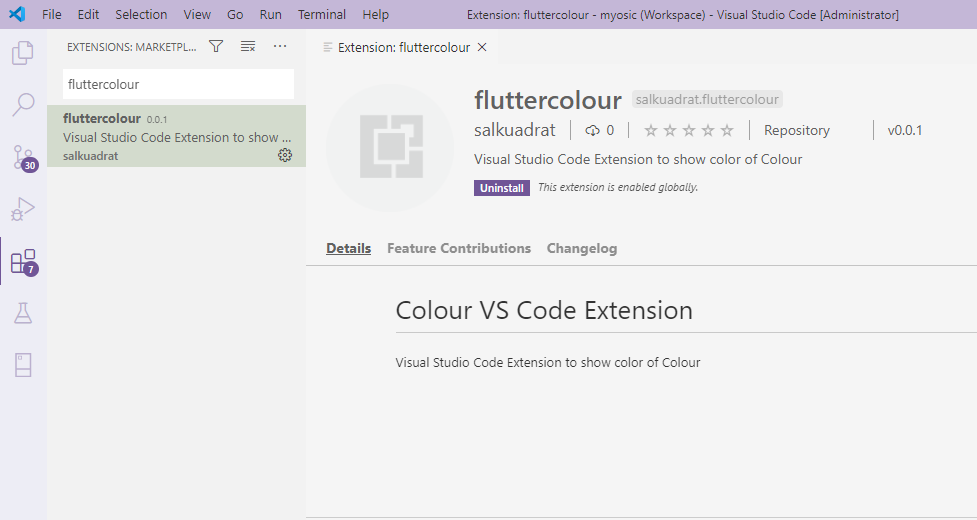
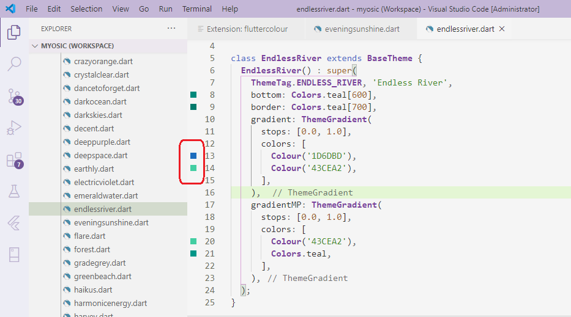

# Colour

An easy way to use color in flutter (with Normal, HEX, RGB, ARGB, or RGBO format).

## Getting Started

In your flutter project add the dependency:

```
dependencies:
  colour: any
```

or reference the git repo directly:

```
dependencies:
  colour:
    git: https://github.com/salkuadrat/colour.git
```

## Examples

You can use it like a normal Color:
```
Colour(0xFFFFFFFF)
Colour(0x00000000)

// with opacity
Colour(0xFFFFFFFF, 0.25)
Colour(0xFFFFFFFF, 0.5)
```

Or with any HEX color formats:
```
Colour('121212')
Colour('#121212')
Colour('af12dc')
Colour('#af12dc')
Colour('AF12DC')
Colour('#AF12DC')
Colour('FF121212')
Colour('#FF121212')
Colour('ff1212aa')
Colour('#ff1212aa')

// with opacity
Colour('121212', 0.25)
Colour('#121212', 0.5)
Colour('af12dc', 0.75)
Colour('#af12dc', 1.0)
Colour('AF12DC', 0.0)
Colour('#AF12DC', 0.25)
Colour('FF121212', 0.3)
Colour('#FF121212', 0.8)
Colour('ff1212aa', 0.6)
Colour('#ff1212aa', 0.42)
```

Feel free to use RGB format.
```
Colour(255, 255, 255)
Colour(0, 0, 0)
Colour(120, 120, 80)
```

It can also be used with ARGB format.
```
Colour(0, 255, 255, 255) // shorter than Color.fromARGB(0, 255, 255, 255)
Colour(255, 0, 0, 0)
Colour(75, 120, 120, 80)
```

RGBO format can works fine too...
```
Colour(255, 255, 255, 0.0) // shorter than Color.fromRGBO(255, 255, 255, 0.0)
Colour(0, 0, 0, 0.5)
Colour(120, 120, 80, 1.0)
```

Anyhow, this is a rare case. Suppose you already have a defined variable of Color.
You can apply opacity to Color using Colour like this:
```
// suppose you already have an existing Color
Color _color = Colors.teal;

// apply opacity with Colour 
Colour(_color, 0.75) // the same as _color.withOpacity(0.75)
```

# Visual Studio Code Extension

You can search and install extension named ```fluttercolour``` to show Colour preview.




